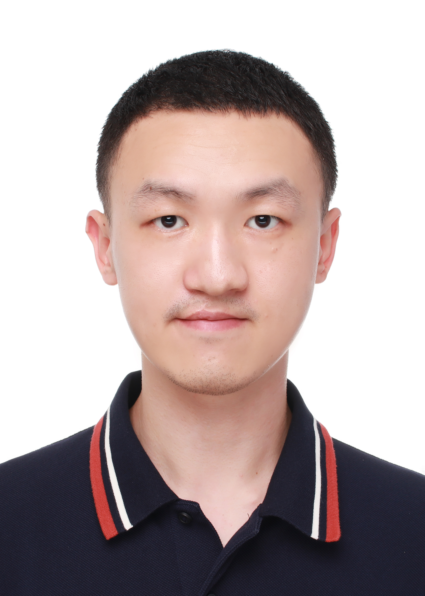

# 姜庆彩

 

**This page may be out of date. Please refer to https://qcjiang.github.io/ for the latest information.**

**邮箱:** jqc@mail.ustc.edu.cn，jqc9707@gmail.com

**研究兴趣:** 计算机体系结构（近存计算相关），并行计算（异构系统上大规模密度泛函计算软件的优化） 和系统建模（在AArch64系统上改进静态代码分析工具）

## 教育经历

-  2019年9月-现在 硕博连读 中国科学技术大学 计算机科学与技术学院  导师：<a href="https://cs.ustc.edu.cn/2020/0426/c23235a460072/page.htm" target="blank">安虹</a>     
-  2015年9月-2019年7月本科 中国科学技术大学 计算机科学与技术学院

## 研究经历

**2019年1月-2019年8月 在多GPU平台上加速线性响应的含时密度泛函理论软件（Linear-Response Time-Dependent Density Functional Theory, LR-TDDFT）**

- 将LR-TDDFT移植到8块V100GPU组成的服务器上，并使用共享内存，混合精度等方法进行加速
- 设计了一种流水线式的矩阵乘-规约方法，以重叠计算和通信
- 成果：已发表论文中的第一项

**2019年11月-2020年8月 使用低秩分解和迭代求解器对LR-TDDFT软件进行加速**

- 使用基于K-Means方法的插值式可分离密度拟合算法（interpolative separable density fitting, ISDF）方法对LR-TDDFT中的双电子积分进行近似，并使用隐式的局部最优块状预处理共轭梯度方法（locally optimal block preconditioned conjugate gradient, LOBPCG）迭代求解计算中的N个最小特征值
- 在Cori超算上大规模并行至12288个CPU核心，将LR-TDDFT计算的规模推进到4096个硅原子
- 成果：已发表论文中的第二项和获奖情况中的第三项

**2019年8月-2022年4月 在神威和新神威超级计算机上对间断伽辽金密度泛函理论软件（discontinuous Galerkin density functional theory, DGDFT）进行加速**

- 根据神威异构处理器的特点，对DGDFT软件进行针对性优化，包括数据结构优化，从核编程优化等
- 对DGDFT的IO模块进行了针对性优化
- 成果：已发表论文中的第四项和第五项，并入围了2022年戈登贝尔奖

**2021年9月-2022年8月 鲲鹏处理器负载建模研究（华为合作课题）**

- 在鲲鹏920处理器上收集了描述一条指令的基本信息，包括吞吐量，时延，端口执行情况等
- 使用真实应用构建了一套基本代码块的基准测试程序，以及一个二进制代码运行环境用来执行基本代码块，并得到准确的吞吐量
- 解决了llvm-mca中导致基本代码块吞吐量预测不准确的几个问题，大幅度提高了精确度

- 成果：已发表论文中的第三项

## 工业界经历

2018年10月-2019年3月 软件开发实习生 华为技术有限公司

## 已发表论文

1. <u>Qingcai Jiang</u>, Lingyun Wan, Shizhe Jiao, et al. An Efficient Multi-GPU Implementation for Linear-Response Time-Dependent Density Functional Theory, in 2020 IEEE 22nd International Conference on High Performance Computing and Communications (**HPCC'2020**). IEEE, 2020: 197-205. <a href="../pdf/lrtddft_gpu_hpcc2020.pdf" target="blank">[pdf文件]</a>

2. <u>Qingcai Jiang</u>, Junshi Chen, Lingyun Wan, et al.  Accelerating Parallel First-Principles Excited-State Calculation by Low-Rank Approximation with K-Means Clustering, in 51st International Conference on Parallel Processing (**ICPP'2022**). <a href="../pdf/lrtddft_isdf_icpp2022.pdf" target="blank">[pdf文件]</a> <a href="https://www.youtube.com/watch?v=fjSMj3iBNpU&list=PLv0Xcy0uv4R9EnuG01ZC8Ega5oydARAmT&index=3&ab_channel=ICPP2022" target="blank">[报告视频]</a>

3. <u>Qingcai Jiang</u>, Shaojie Tan, Zhenwei Cao, et al. Quantifying Throughput of Basic Blocks on ARM Microarchitectures by Static Code Analyzers: A Case Study on Kunpeng 920, in 2022 IEEE 24th Int Conf on High Performance Computing & Communications (**HPCC'2022**).<a href="../pdf/static_code_analyzer_hpcc2022.pdf" target="blank">[pdf文件]</a>

4. Wei Hu\*, Hong An, Zhuoqiang Guo\*, <u>Qingcai Jiang</u>\*, et al. 2.5 Million-Atom Ab Initio Electronic-Structure Simulation of Complex Metallic Heterostructures with DGDFT, in Proceedings of the 2022 International Conference for High Performance Computing, Networking, Storage and Analysis (**SC'2022**). Awarded as a **2022 ACM Gordon Bell Finalist**. <a href="https://sc22.supercomputing.org/presentation/?id=gb105&sess=sess191" target="blank">[入围戈登贝尔奖链接]</a> <a href="../pdf/dgdft_sc2022.pdf" target="blank">[pdf文件]</a> <a href="http://news.ustc.edu.cn/info/1055/81128.htm" target="blank">[中文新闻稿]</a> 

5. Wei Hu, Xinming Qin, <u>Qingcai Jiang</u>, et al. High performance computing of DGDFT for tens of thousands of atoms using millions of cores on Sunway TaihuLight, in **Science Bulletin**, 2021, 66(2): 111-119. <a href="../pdf/dgdft_sunway_scibull2020.pdf" target="blank">[pdf文件]</a>

\* : 共同一作

## 教学工作

中国科学技术大学

- 助教 计算机系统概论A（CS1002A）2021年秋季学期

- 助教 程序设计II （011175）2020年春季学期

- 助教 计算机系统概论H（011704） 2019年秋季学期

- 助教 人工智能导论（011119）2019年春季学期

  

## 获奖情况

1. 第七届亚太地区RDMA编程挑战赛一等奖 <a href="http://news.ustc.edu.cn/info/1055/49558.htm" target="blank">[中文新闻稿]</a>  
2. 第八届亚太地区RDMA编程挑战赛一等奖 <a href="http://news.ustc.edu.cn/info/1047/73404.htm" target="blank">[中文新闻稿]</a> <a href="http://en.ustc.edu.cn/info/1007/3145.htm" target="blank">[英文新闻稿]</a> 
3. 第八届全国并行应用挑战赛 应用组一等奖<a href="http://news.ustc.edu.cn/info/1055/73007.htm" target="blank">[中文新闻稿]</a> <a href="http://en.ustc.edu.cn/info/1007/3073.htm" target="blank">[英文新闻稿]</a> 
4. 2020年ASML计算光刻及超算软件奖学金 <a href="../picture/asml_scholarship.jpg" target="blank">[照片]</a>
5. 2022年环球数码奖学金 <a href="../picture/gdc_scholarship.jpg" target="blank">[照片]</a>

## 技能

- 编程语言：C/C++ Python LaTeX 
- 工具：Vim Linux Office
